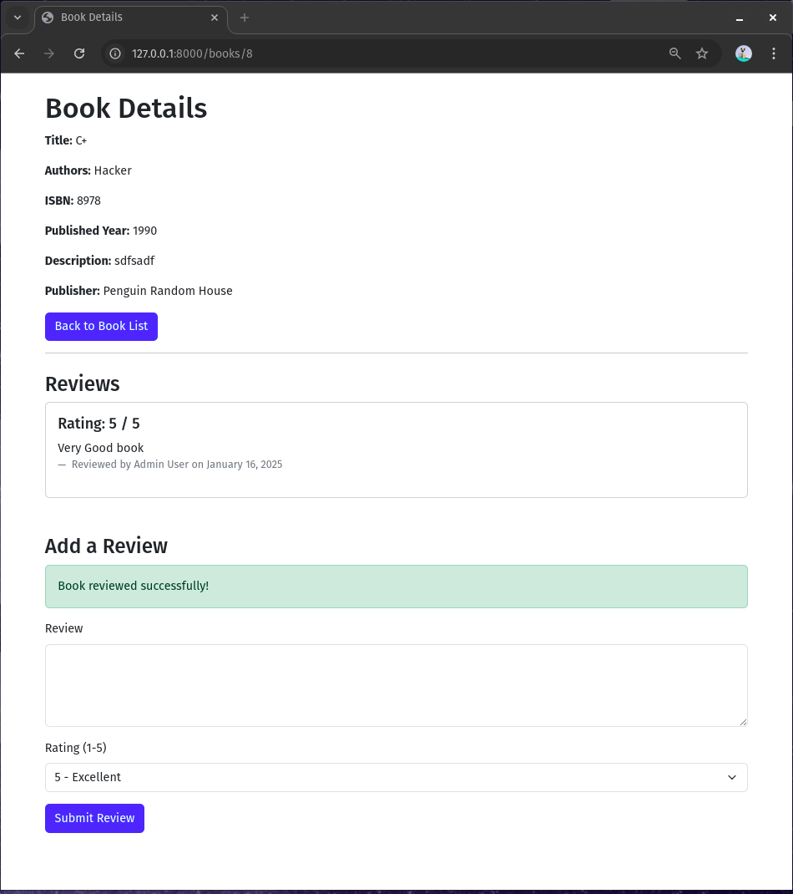

# Library Management System

<p align="center">
  <a href="https://laravel.com" target="_blank">
    
  </a>
</p>

<p align="center">
  A Laravel-based Library Management System to manage books, authors, publishers, borrowers, and reviews. Built with expressive, elegant syntax to ensure efficient management and seamless user experience.
</p>

---

## Table of Contents

- [Project Description](#project-description)
- [Features](#features)
- [Installation Steps](#installation-steps)
- [Usage Guide](#usage-guide)
- [Screenshots](#screenshots)
- [Contributing](#contributing)
- [License](#license)

---

## Project Description

This Library Management System allows administrators to manage books, authors, publishers, and borrowers, while users can borrow books and leave reviews. The system also supports authentication, user roles, book borrowing history, and a public books page accessible without logging in.

---

## Features

### Core Features

- **Admin Panel**:
  - Add, edit, delete, and restore books (with soft delete functionality).
  - Manage authors, publishers, and borrowers.
  - View trashed books and restore them.

- **User Panel**:
  - Borrow and return books.
  - View borrowed books history.
  - Leave reviews for books, authors, and publishers.

- **Public Access**:
  - View available books without logging in.

### Additional Features

- **Authentication**:
  - Admin and user roles with restricted access.
  - User login, registration, and profile management.

- **Database Relationships**:
  - One-to-Many: Authors and books.
  - Many-to-Many: Books and publishers.
  - Polymorphic: Reviews for books, authors, and publishers.

- **Search and Filter**:
  - Search books by title, author, or ISBN.
  - Filter books by availability (available/borrowed).

- **Pagination**:
  - Paginated views for book lists and borrowing history.

- **Front-end Integration**:
  - Styled with TailwindCSS and Bootstrap for a responsive design.

---

## Installation Steps

### Prerequisites
- PHP 8.1 or higher
- Composer
- MySQL 
- Node.js and npm
- Laravel 10.x

Follow these steps to set up the project locally:

1. **Clone the Repository**:
   ```bash
   git clone <repository-link>
   cd Library_Management_System
   ```

2. **Install Dependencies**:
   ```bash
   composer install
   npm install
   npm run dev
   ```

3. **Set Up Environment**:
   - Copy `.env.example` to `.env`:
     ```bash
     cp .env.example .env
     ```
   - Configure database credentials in the `.env` file.

4. **Generate Application Key**:
   ```bash
   php artisan key:generate
   ```

5. **Run Migrations and Seed Database**:
   ```bash
   php artisan migrate --seed
   ```

6. **Start the Development Server**:
   ```bash
   php artisan serve
   ```
   - Open the application at `http://127.0.0.1:8000`.

---

## Usage Guide

### Admin Role

1. Log in as an admin (use seeded credentials or register a new admin account).
    Email: admin@example.com
    Password: password
2. Navigate to the admin dashboard to manage books, authors, publishers, and borrowers.
3. Use the "View Trashed Books" feature to restore deleted books.

### User Role

1. Log in as a user (use seeded credentials or register a new user account).
2. Browse books, borrow available books, and view borrowing history.
3. Leave reviews for books, authors, and publishers.

### Public Access

1. Visit `http://127.0.0.1:8000/public-books` to view the list of available books without logging in.

---

## Screenshots

### Home Page (Welcome Page)


### Admin Dashboard


### User Dashboard


### Borrowing History


### Admin Book List


### Public Books Page


### Manage Publisher Page


### Manage Borrower Page


### Manage Author Page


### Review Book Page


### Review Publisher Page


### Review Author Page


---

## Contributing

Contributions are welcome! Please fork the repository and submit a pull request.

---

## License

This project is open-source and available under the [MIT license](https://opensource.org/licenses/MIT).

---

### Contact

For questions or feedback, please contact the project owner.
